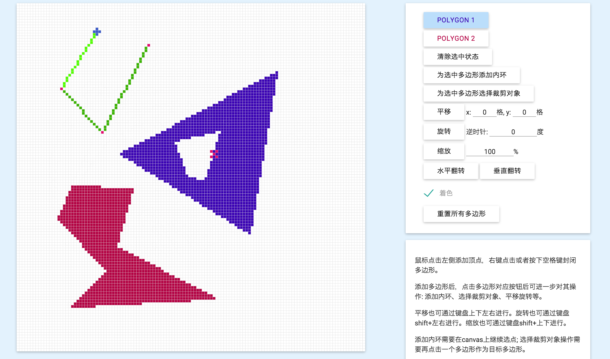
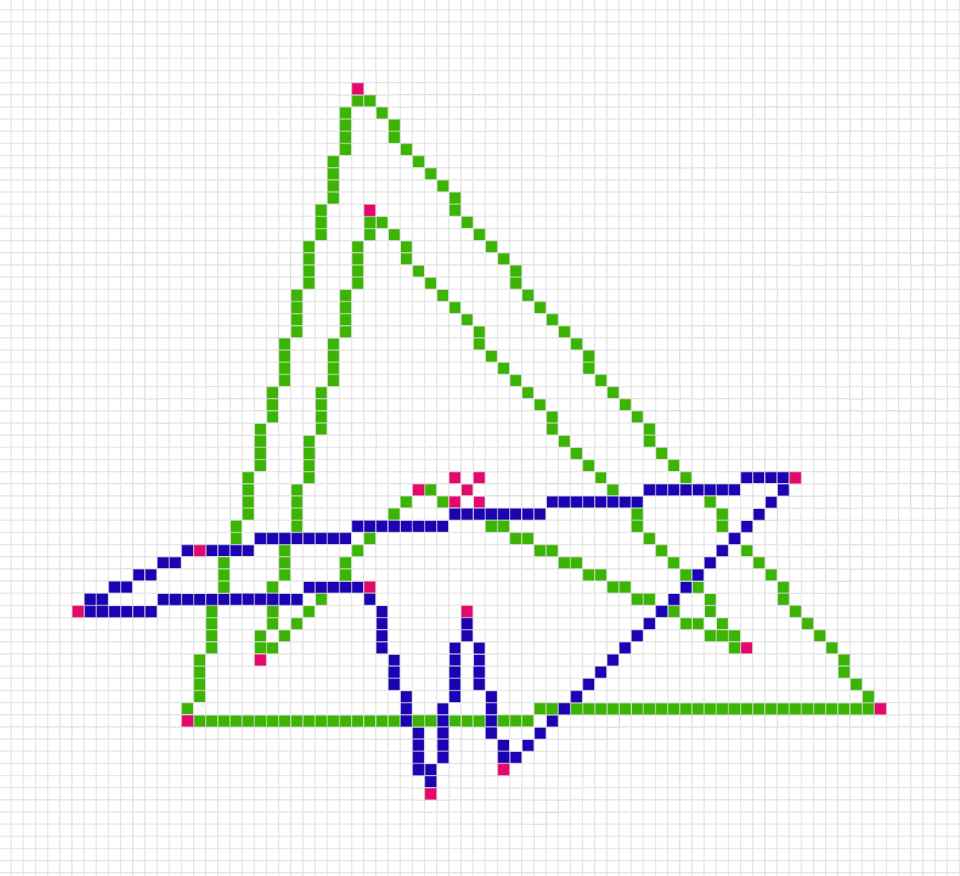
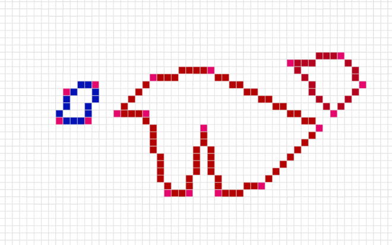
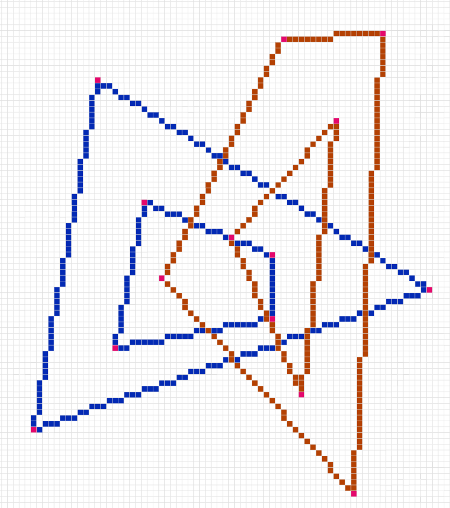
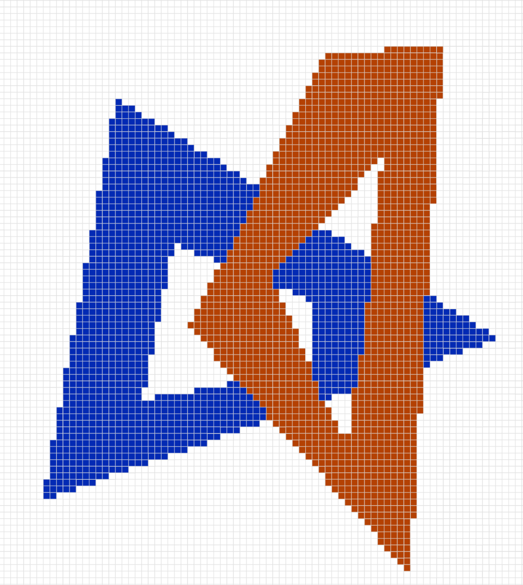

#图形学作业一
软件21 周伯威  
2012012221  
***

###一、用户界面

*注意: 需要在Chrome浏览器上运行，使用IE等其他浏览器可能出现各种不兼容现象。*  

###二、操作方法

* 在绘图区域点击鼠标，绘制多边形。在还差一条边没有绘制时，右键点击画布或者按下空格键可以自动封闭多边形。  
* 点击右上侧按钮可以选择目标多边形。选中后，点击下面按钮可以进行进一步的操作:  
	* 清除选中状态: 取消对多边形的选择。
	* 添加内环: 点击后，紧接着绘制的下一个多边形将成为目标多边形的内环。
	* 选择裁剪对象: 点击该按钮后，要继续点击另一多边形对应的**按钮**。将进行裁剪操作，原多边形作为主多边形，后点击的将作为裁剪多边形。
	* 平移、旋转、缩放、翻转。
	* 着色。
	* 重置多边形: 清除当前所有多边形。
* 部分操作可以用键盘代替:  
  
	操作 | 键盘方法  
	---|---  
	封闭多边形 | space  
	平移| 上下左右  
	旋转| shift+左右
	缩放| shift+上下  
	翻转| alt+上下左右  
  
### 三、效果展示  

##### 裁剪  

  

  

##### 着色

  

  

### 四、特色
* 仅使用了setPixel函数。
* 可以判断多边形合理性，避免内环画在外面、多边形自相交等状况。
* 交互友好，可以轻松添加多边形并对其操作。
* 允许存在多个多边形。
* 手动实现了双缓冲绘制，刷新时只绘制发生变化的像素，大大节约时间。

### 五、算法概览
在这里列出程序用到的主要的函数。

功能|函数名|算法
---|---|---
画线|_lineTo|Bresenham算法。
着色|colorPolygons|逐点判断方法。
求坐标是否在多边形内|isIn|将该点与多边形各个顶点连线，分别求内外环各个夹角的度数和。若在外环内、内环外，则为多边形内部
判断线段是否相交|isTwoLinesCross|先判断显然不相交的情况，再求向量叉积判断
判断多边形自相交|checkCross|枚举各边是否相交
求线段交点|crossPoint|先判断相交，再求两直线方程交点
封闭多边形|closePath|判断是否自相交; 将当前绘制的线段排序，并压进polygons数组; 添加按钮
对线段排序(顺逆时针)|sortVertex|使用[Paul Bourke的方法](http://debian.fmi.uni-sofia.bg/~sergei/cgsr/docs/clockwise.htm)，并区分内外环
求几何重心|getCenter|参照维基百科的公式，并非简单的求各个点坐标平均值: $$A=\frac{1}{2}\sum_{i=0}^{N-1}(x_iy_{i+1}-x_{i+1}y_i)\\C_x=\frac{1}{6A}\sum_{i=0}^{N-1}(x_i+x_{i+1})(x_iy_{i+1}-x_{i+1}y_i)\\C_y=\frac{1}{6A}\sum_{i=0}^{N-1}(y_i+y_{i+1})(x_iy_{i+1}-x_{i+1}y_i)$$此外，内环相当于负质量，应减去。
旋转|rotate|将选中的多边形的各个顶点相对于多边形重心的各个向量分别旋转，再加回重心
多边形边交点排序|sortCrossPoint|该函数在裁剪多边形中用到，目的是对主多边形的一条边与裁剪多边形的交点的排序。根据端点的顺序，对各个交点的横坐标做冒泡排序。
裁剪多边形|cutPolygon|使用Weiler-Atherton算法。先改变多边形数据结构，从边表转成顶点表。再求两个多边形的交点，并插入顶点表，对应的顶点索引关系存储在connect数组中。**若connect为空**则特殊处理。接下来从connect数组中选点开始算法，标记connect数组的元素。回到起始点后，将当前多边形push进结果数组，并寻找下一个未标记的connect，继续算法。最后，将顶点表转换回边表。产生的结果可能有多个多边形，它们将被作为不同的多边形依次被添加。

	
	